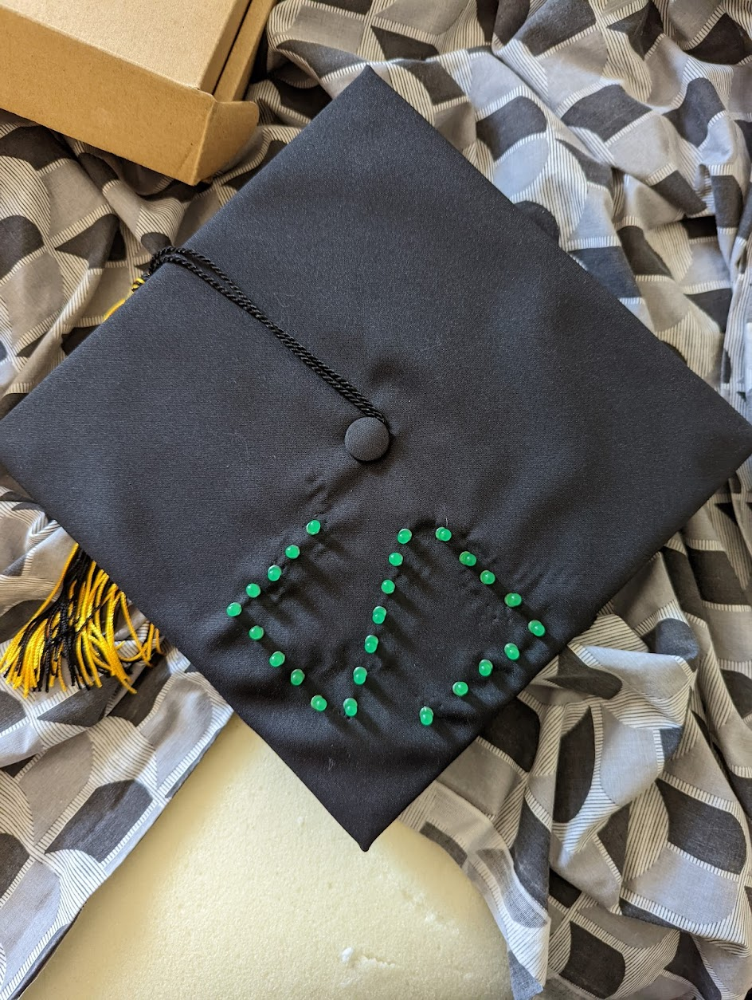
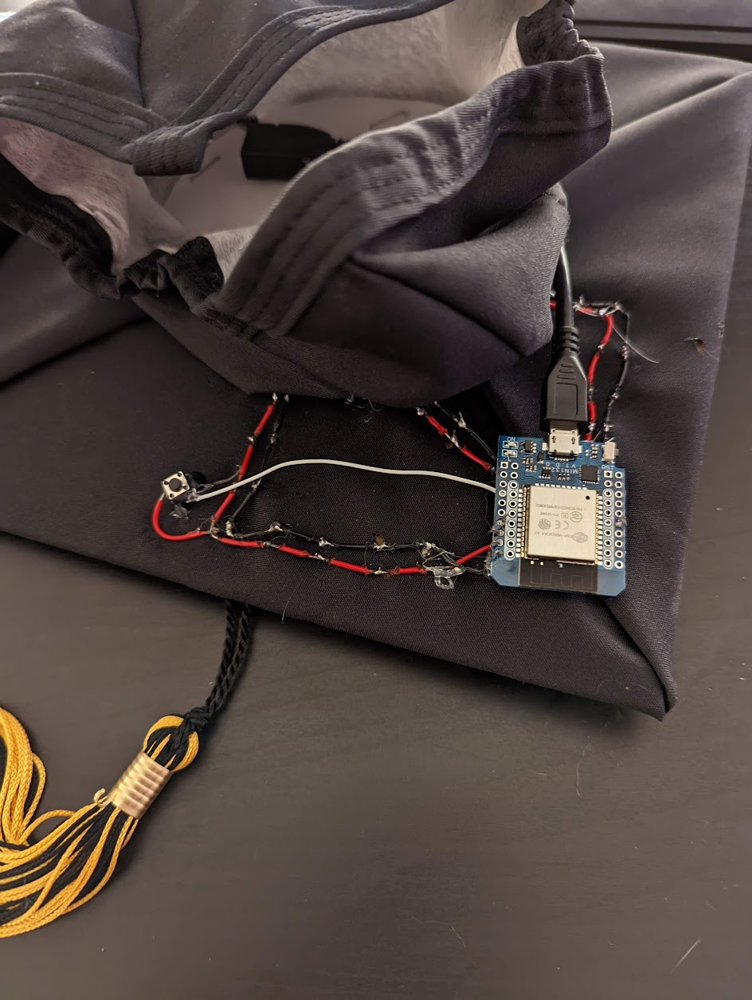
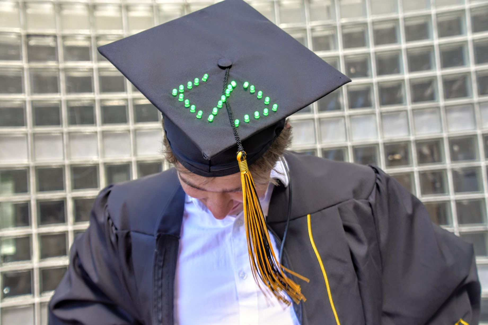

# Grad cap project

Borrowing some of my ideas from [Covalent](https://github.com/alexwohlbruck/covalent), I decided to repurpose one of my D1 mini boards to decorate my graduation gap with LED lights. This project utilizes Micropython to compile simple Python to machine code, which captures inputs from the attached button and displays 3 different LED effect patterns.

### Results

  
  
  
  

